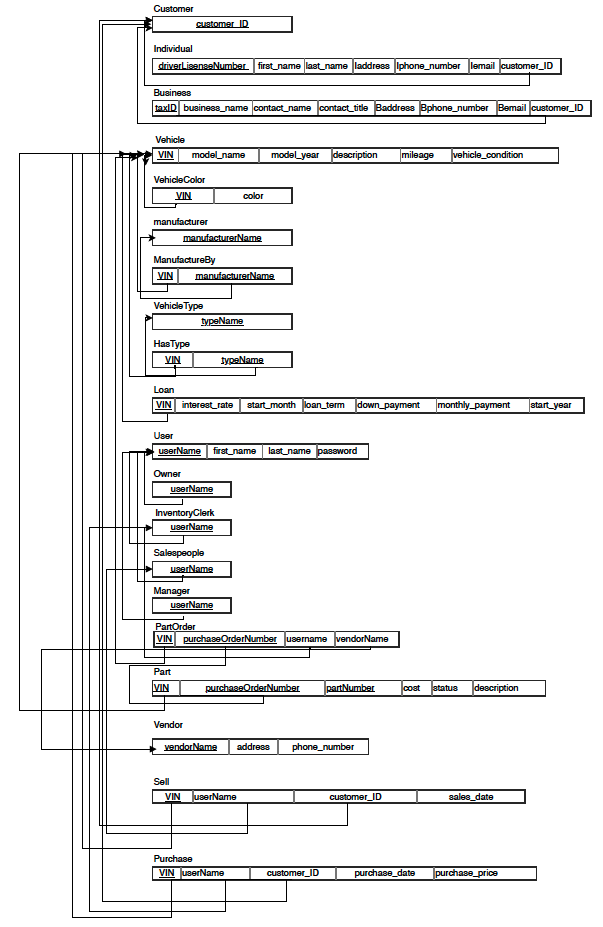
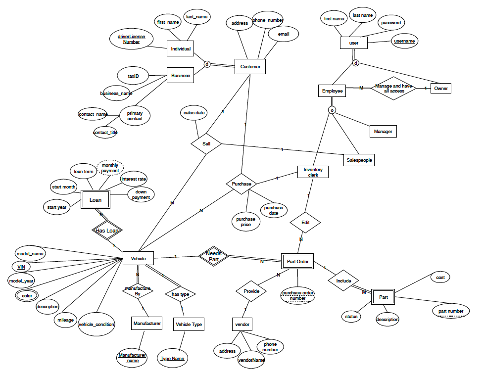

# Car Dealership Management Web App

## Description
Built a web app with PHP for dealers to manage their inventories and business reports. Used LAMP (Linux, Apache, MySQL, PHP) stack for web app development. Designed and implemented the data schemas and business reports aggregations based on MySQL.

## Users
• Customers
• Inventory clerks, who buy vehicles and add them to inventory, along with information about the car’s previous owner (also considered customer information), and enter parts orders
• Salespeople, who will only have access to searching available inventory, entering customer information, and entering sales transactions
• Managers, who can view inventory, purchase history, sales transactions, parts order history, and reports
• And the owner, Mr. Burdell, who has access to everything and can perform any activity in the system (a combination of all permissions)

## Application Functionality

### Public Access
The public search page should initially display somewhere prominent, the total number of cars available for purchase in the system, that is, cars without any pending parts orders. Searching can be done on the following criteria: Vehicle type, Manufacturer, Model year, Color, Keyword.

### Privileged Access
Users who are employees of Burdell’s will have access to additional features in order to perform their job duties. Privileged users will login using their username and password.

## Business Reports

### Seller History
This report will show detail about all vehicles purchased by Burdell’s and their sellers. The report is sorted by total number of vehicles sold descending, followed by average purchase price ascending.

### Average Time In Inventory
This report, based on the difference between vehicle sales dates and the vehicle purchase dates, will display, by vehicle type, the average amount of time a vehicle remains in inventory, in days.

### Price Per Condition
This report will display, by vehicle type, and for each condition (Excellent, Very Good, Good, Fair), the average price paid for cars that Burdell’s has purchased.

### Parts Statistics
Mr. Burdell thinks that he can negotiate better prices with parts vendors but wants to have good information to take to the bargaining table. In this report, you should list: the vendor name, the number of parts supplied by that vendor, and the total dollar amount spent on parts.

### Monthly Loan Income
This report will list, for the last twelve months (including the current month) any loan payment amounts that should be expected.

### Monthly Sales
This report will show a summary page, which lists for all sales transactions, by year and month, the total number of vehicles sold, the total sales income, and the total net income (which is sales price less purchase price and any parts costs).

## EER To Relational Mapping

## EER Diagram

